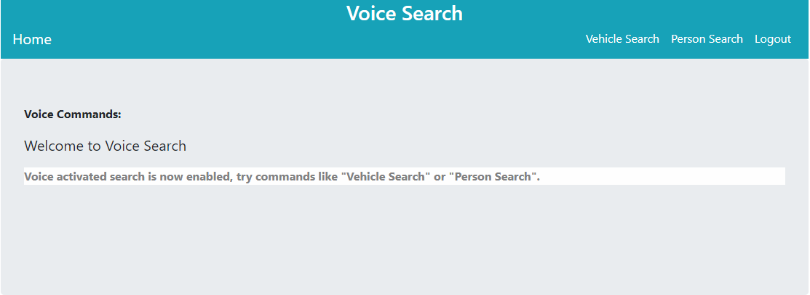

# VOICE SEARCH

This project uses users voice input to search for information inside the application and will return search results with a voice-over feed back. This project was developed using Java, Spring Boot and Web Speech API toolkit and hosted on AWS Elastic Beanstalk.

